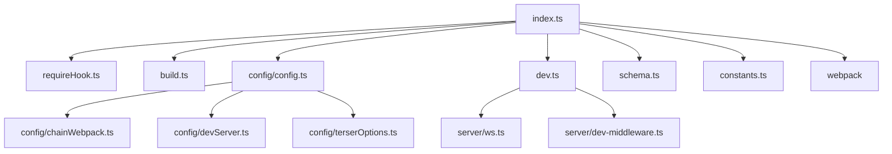
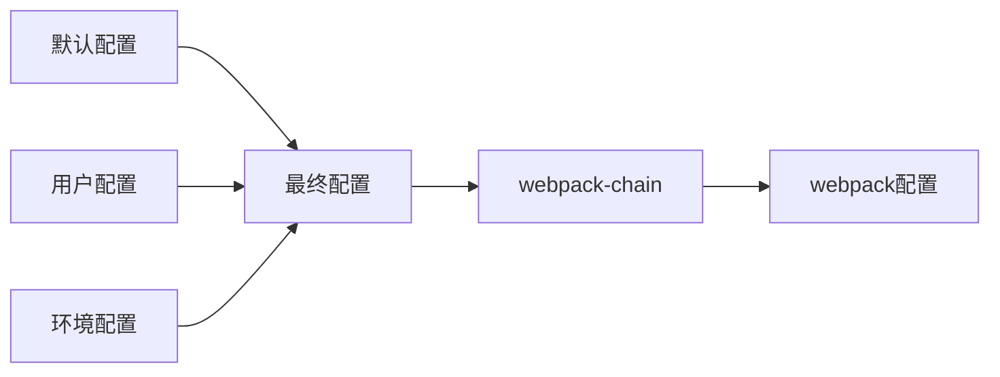
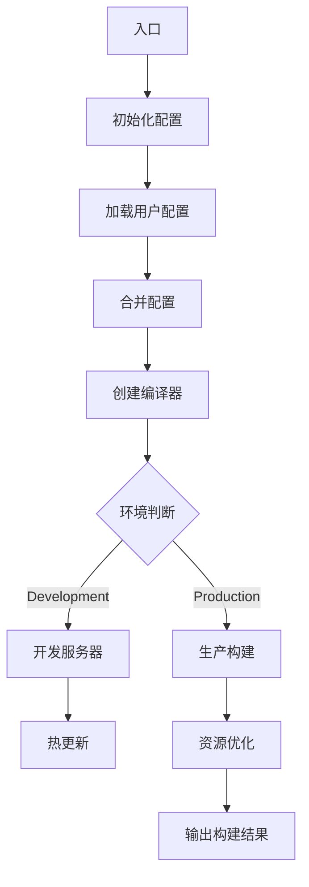
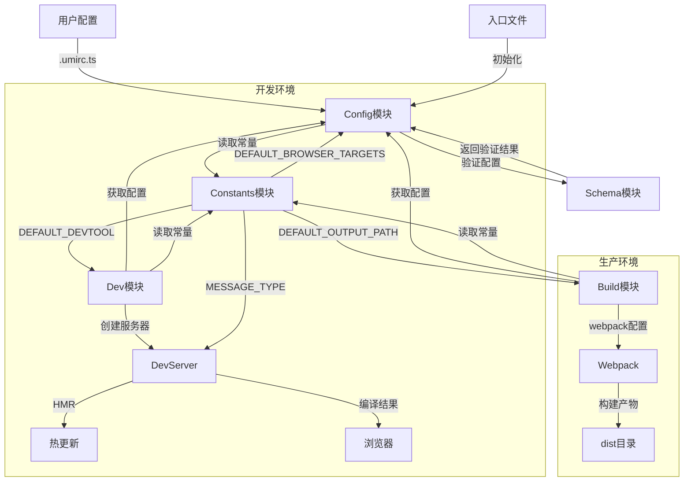
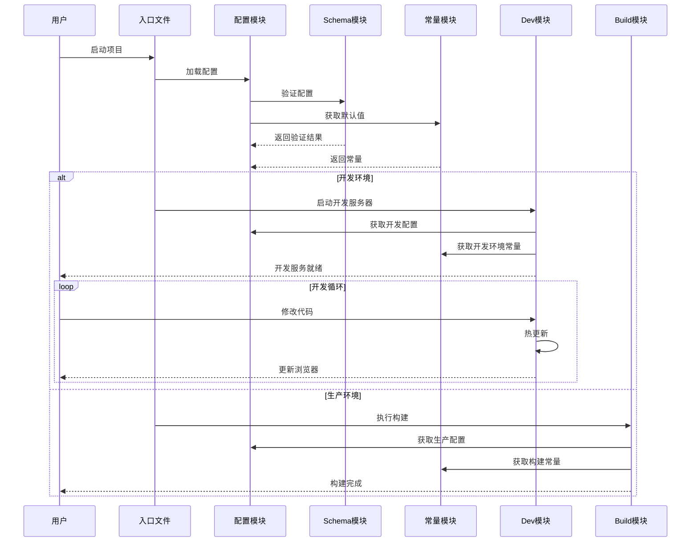

# 整体概览

**@umijs/bundler-webpack源码解析-前置知识**

## 概述

@umijs/bundler-webpack 是 UmiJS 框架中负责构建打包的核心包，基于 Webpack 5 实现。它封装了 webpack 的配置和构建流程，为 Umi 应用提供开箱即用的构建能力。

## 目录结构

```bash
packages/bundler-webpack/               # Umi webpack打包器根目录
├── .fatherrc.ts                       # Father构建配置
├── package.json                       # 项目配置和依赖
├── README.md                          # 项目说明文档
├── tsconfig.json                      # TypeScript配置
│
├── bin/                               # 可执行文件目录
│   └── bundler-webpack.js            # CLI入口文件
│
├── bundles/                          # 打包资源目录
│   ├── react-refresh/               # React热更新相关
│   └── webpack/                     # Webpack相关资源
│
├── client/                          # 客户端代码
│   ├── constants.js                # 客户端常量
│   ├── client/                    # 客户端核心代码
│   └── utils/                     # 客户端工具函数
│
├── compiled/                       # 预编译依赖
│   ├── express.d.ts               # Express类型定义
│   ├── webpack/                   # Webpack核心依赖
│   ├── autoprefixer/             # CSS自动前缀
│   ├── babel-loader/            # Babel加载器
│   ├── ...                      # 等等
│   └── schema-utils/           # Schema验证工具
│
├── scripts/                  # 构建脚本
│   └── build.js             # 构建脚本
│
└── src/                               # 源代码根目录
		├── index.ts                       # 主入口文件
		├── build.ts                      # 构建相关实现
		├── dev.ts                        # 开发服务器实现
		├── requireHook.ts                # Node.js require钩子
		├── constants.ts                  # 常量定义
		├── schema.ts                     # 配置schema定义
		├── types.ts                      # 类型定义
		│
		├── client/                       # 客户端代码
		│   ├── index.ts                 # 客户端入口
		│   ├── client.ts                # 客户端核心逻辑
		│   ├── socket.ts                # WebSocket通信
		│   └── overlay.ts               # 错误覆盖层
		│
		├── config/                         # webpack配置相关目录
		│   ├── _sampleFeature.ts              # 示例特性配置
		│   ├── assetRules.ts                  # 静态资源规则配置
		│   ├── bundleAnalyzerPlugin.ts        # 包分析插件配置
		│   ├── compressPlugin.ts              # 压缩插件配置
		│   ├── config.ts                      # webpack主配置生成
		│   ├── copyPlugin.ts                  # 文件复制插件配置
		│   ├── cssRules.ts                    # CSS规则配置 
		│   ├── definePlugin.test.ts           # 定义插件测试文件
		│   ├── definePlugin.ts                # 定义插件配置
		│   ├── detectCssModulesInDependence.ts  # 依赖CSS Modules检测
		│   ├── detectDeadCode.ts              # 死代码检测工具
		│   ├── detectDeadCodePlugin.ts        # 死代码检测插件
		│   ├── fastRefreshPlugin.ts           # 快速刷新插件配置
		│   ├── forkTSCheckerPlugin.ts         # TypeScript检查插件 
		│   ├── harmonyLinkingErrorPlugin.ts   # 模块链接错误处理
		│   ├── ignorePlugin.ts                # 忽略模块配置
		│   ├── javaScriptRules.ts            # JavaScript规则配置
		│   ├── manifestPlugin.ts             # Manifest插件配置
		│   ├── miniCSSExtractPlugin.ts       # CSS提取插件配置
		│   ├── nodePolyfill.ts              # Node.js polyfill配置
		│   ├── nodePrefixPlugin.ts          # Node前缀处理插件
		│   ├── progressPlugin.ts            # 进度插件配置
		│   ├── speedMeasureWebpackPlugin.ts # 构建速度分析插件
		│   ├── ssrPlugin.ts                # SSR插件配置
		│   └── svgRules.ts                # SVG规则配置
		│
		├── fixtures/                     # 测试用例和示例
		│   ├── basic/                   # 基础示例
		│   ├── css/                     # CSS相关测试
		│   └── plugins/                 # 插件测试
		│
		├── loaders/                      # 自定义loader
		│   ├── svgr.ts                  # SVG转React组件
		│   ├── file.ts                  # 文件处理
		│   └── url.ts                   # URL处理
		│
		├── server/                       # 服务端代码
		│   ├── index.ts                 # 服务端入口
		│   ├── middleware/              # 中间件
		│   │   ├── dev.ts              # 开发中间件
		│   │   └── hmr.ts              # 热更新中间件
		│   └── utils/                   # 服务端工具
		│       ├── paths.ts            # 路径处理
		│       └── progress.ts         # 进度显示
		│
		├── plugins/                      # webpack插件
		│   ├── copy.ts                  # 文件复制
		│   ├── define.ts               # 变量定义
		│   └── miniCss.ts             # CSS提取
		│
		├── utils/                        # 工具函数
		│   ├── getConfig.ts             # 配置获取
		│   ├── getPaths.ts              # 路径处理
		│   └── stats.ts                 # 构建统计
		│
		└── middlewares/                  # Express中间件
		    ├── compression.ts           # 压缩中间件
		    └── history.ts              # History API

# compiled 目录是webpack预编译的依赖，是@umijs/bundler-webpack在构建的时候就已经生成了，这也是chengcheng说的锁死依赖。
# 构建的脚本是
"scripts": {
  "build:deps": "umi-scripts bundleDeps",  // compiled
  "generate:webpackPackages": "zx ./scripts/generateWebpackPackages.mjs", // bundles/webpack/packages
},

# bundleDeps 命令在 scripts/bundleDeps.ts

await buildDep({
  ...(isDep ? { pkgName: dep } : { file: dep }),
  target: `compiled/${isDep ? dep : path.basename(path.dirname(dep))}`,
  base,
  webpackExternals,
  dtsExternals,
  clean: argv.clean,
  minify: !noMinify.includes(dep),
  dtsOnly: extraDtsDeps.includes(dep),
  noDts: excludeDtsDeps.includes(dep),
  isDependency: dep in pkgDeps,
});
```

配置文件是关键

让我根据功能将 config 目录下的配置文件分类：

## 核心配置文件

```
config/
└── config.ts                      # webpack主配置生成器
```

## 资源处理规则相关

```
config/
├── assetRules.ts                  # 静态资源(图片等)规则
├── cssRules.ts                    # CSS处理规则
├── javaScriptRules.ts            # JavaScript处理规则
└── svgRules.ts                   # SVG处理规则
```

## 优化和压缩相关

```
config/
├── bundleAnalyzerPlugin.ts        # 包分析插件
├── compressPlugin.ts              # 压缩插件
├── detectDeadCode.ts              # 死代码检测
├── detectDeadCodePlugin.ts        # 死代码检测插件
└── speedMeasureWebpackPlugin.ts   # 构建速度分析
```

## 开发体验相关

```
config/
├── fastRefreshPlugin.ts           # 快速刷新(HMR)
├── forkTSCheckerPlugin.ts         # TypeScript类型检查
└── progressPlugin.ts              # 构建进度展示
```

## CSS 相关插件

```
config/
├── detectCssModulesInDependence.ts  # 依赖包CSS Modules检测
└── miniCSSExtractPlugin.ts          # CSS提取插件
```

## Node.js 相关

```
config/
├── nodePolyfill.ts               # Node.js API的浏览器polyfill
└── nodePrefixPlugin.ts           # Node模块前缀处理
```

## 构建流程相关

```
config/
├── copyPlugin.ts                 # 静态资源复制
├── definePlugin.ts               # 环境变量定义
├── ignorePlugin.ts              # 忽略特定模块
├── manifestPlugin.ts            # 资源清单生成
└── ssrPlugin.ts                 # 服务端渲染支持
```

## 错误处理相关

```
config/
└── harmonyLinkingErrorPlugin.ts  # 模块链接错误处理
```

## 测试相关

```
config/
├── _sampleFeature.ts            # 示例特性
└── definePlugin.test.ts         # 定义插件测试
```

这些配置文件共同构建了 Umi 的 webpack 构建系统，每个文件都有其特定的职责：

1. **资源处理**：处理各种类型的文件（JS/CSS/图片等）
2. **优化相关**：提供构建优化和分析能力
3. **开发体验**：提供更好的开发体验（HMR/类型检查等）
4. **CSS 处理**：专门处理 CSS 相关的功能
5. **Node.js 支持**：处理 Node.js 相关的兼容性问题
6. **构建流程**：处理整体构建流程中的各个环节
7. **错误处理**：处理构建过程中的错误情况
8. **测试相关**：用于测试和示例的文件

```bash

```

## 主要功能

1. **配置管理**
    - 使用 `webpack-5-chain` 管理 webpack 配置
    - 提供了开发和生产环境的默认配置
    - 支持自定义配置扩展
2. **资源处理**
    1. CSS 处理: 支持 CSS/Less/Sass/Stylus
        - `css-loader`
        - `less-loader`
        - `sass-loader`
        - `postcss-loader`
    2. 静态资源:
        - `file-loader`
        - `url-loader`
    3. SVG 处理:
        - `@svgr/core`
        - `svgo-loader`
3. **优化功能**
    1. 代码压缩:
        
        ```json
        "terser": "5.16.1",
        "terser-webpack-plugin": "5.3.6"
        ```
        
    2. CSS 优化:
        
        ```json
        "css-minimizer-webpack-plugin": "5.0.1",
        "purgecss-webpack-plugin": "4.1.3"
        ```
        
    3. 分析工具:
        
        ```json
        "webpack-bundle-analyzer": "4.7.0",
        "speed-measure-webpack-plugin": "1.5.0"
        ```
        
4. **开发体验**
    1. 热更新支持
        
        ```json
        "@umijs/react-refresh-webpack-plugin": "0.5.11",
        "react-refresh": "0.14.0"
        ```
        
    2. 开发服务器
        
        ```json
        "webpack-dev-middleware": "6.0.1",
        "ws": "8.12.0"
        ```
        
    3. 构建进度展示
        
        ```json
        "webpackbar": "5.0.2"
        ```
        

## 主要模块说明

1. **BundlerWebpack（入口模块）**
    - 负责整合所有模块
    - 提供主要的 build 和 dev 接口
    - 导出 webpack 配置和类型
2. **Build（构建模块）**
    - `build()`: 执行生产环境构建
    - `getBuildConfig()`: 获取构建配置
    - `generateBuildResult()`: 生成构建结果
    - `buildComplete()`: 处理构建完成后的操作
3. **Config（配置模块）**
    - `getConfig()`: 获取合并后的配置
    - `mergeConfig()`: 合并用户配置和默认配置
    - `resolvePlugins()`: 处理 webpack 插件配置
    - `resolveLoaders()`: 处理 webpack loader 配置
    - `getDefaultConfig()`: 获取默认配置
4. **Dev（开发服务器模块）**
    - `createDevServer()`: 创建开发服务器
    - `setupMiddlewares()`: 设置中间件
    - `setupHMR()`: 配置热更新
    - `watchFiles()`: 监听文件变化
    - `handleCompilation()`: 处理编译过程
5. **Schema（配置校验模块）**
    - `validate()`: 验证配置是否合法
    - `getSchema()`: 获取配置模式定义
6. **Constants（常量模块）**
    - 定义各种默认值和枚举类型
    - 包含开发工具、输出路径等配置
    - 定义消息类型和浏览器目标

## 核心优化点

**依赖优化和预编译处理**

```jsx
"compiledConfig": {
  "deps": [
  ],
  "externals": {
  },
  "noMinify": [
  ],
  "extraDtsDeps": [
  ],
  "extraDtsExternals": [
  ],
  "excludeDtsDeps": [
  ]
}
```

1. 依赖预编译，deps 配置
    
    ```json
    "deps": [
      "autoprefixer",
      "babel-loader",
      "css-loader",
      "less-loader",
      "sass-loader",
      "webpack-5-chain",
      // ...其他依赖
    ]
    
    ```
    
    这些依赖会在构建时被预编译，以提升性能和稳定性。
    
2. 外部依赖处理，externals 配置
    
    ```json
    "externals": {
      "@swc/core": "@swc/core",
      "@babel/core": "@umijs/bundler-utils/compiled/babel/core",
      "esbuild": "@umijs/bundler-utils/compiled/esbuild",
      "webpack": "$$LOCAL",
      // ...
    }
    
    ```
    
    - `$$LOCAL`: 表示使用本地编译版本
    - `@umijs/bundler-utils/compiled/`: 使用预编译的公共依赖
    - 直接引用: 如 `@swc/core` 直接使用包

1. 编译优化策略，不压缩的模块
    
    ```json
    "noMinify": [
      "./bundles/webpack/bundle",
      "terser-webpack-plugin",
      "mini-css-extract-plugin",
      "purgecss-webpack-plugin"
    ]
    
    ```
    
    某些模块不需要压缩，可以:
    
    - 加快构建速度
    - 避免压缩导致的潜在问题

1. TypeScript 类型处理
    - `extraDtsDeps`: 需要额外生成类型的依赖
    - `extraDtsExternals`: 声明为外部类型的依赖
    - `excludeDtsDeps`: 排除类型生成的依赖
    
    ```json
    "extraDtsDeps": ["webpack"],
    "extraDtsExternals": [
      "@swc/core",
      "esbuild",
      "webpack"
    ],
    "excludeDtsDeps": [
      "babel-loader",
      "css-loader",
      // ...
    ]
    
    ```
    

1. **依赖管理**
    - 将常用依赖预编译，减少运行时编译开销
    - 合理区分本地依赖和外部依赖
    - 优化依赖引用路径
2. **构建性能**
    - 选择性跳过压缩步骤
    - 预编译重复使用的模块
    - 优化类型文件生成
3. **包体积优化**
    - 合理使用外部依赖
    - 避免重复打包
    - 分离编译和运行时依赖
4. **稳定性保证**
    - 锁定关键依赖版本
    - 统一依赖管理
    - 预编译减少运行时错误

这种精细的依赖优化和编译处理机制，让 bundler-webpack 能够:

- 提供更快的构建速度
- 确保构建结果的稳定性
- 优化最终的包体积
- 提供更好的开发体验

## 配置示例

一些重要说明：

1. **配置优先级**:
    - 命令行参数 > 环境变量 > 配置文件
2. **环境区分**:
    
    ```bash
    # 开发环境
    UMI_ENV=dev umi dev
    
    # 生产环境
    UMI_ENV=prod umi build
    ```
    
3. **配置文件命名**:
    - `.umirc.ts`
    - `.umirc.js`
    - `config/config.ts`
    - `config/config.js`
4. **TypeScript 支持**: 建议使用 `.ts` 配置文件以获得更好的类型提示
5. **配置验证**: Umi 会对配置进行验证，确保配置值符合预期类型
- config example
    
    ```tsx
    import { defineConfig } from 'umi';
    
    export default defineConfig({
      // 项目基础配置
      base: '/', // 可选值: '/', '/app/', '/docs/'等
      publicPath: '/static/', 
      hash: true,
      history: {
        type: 'browser', // 可选值: 'browser' | 'hash' | 'memory'
      },
    
      // webpack 构建配置
      webpack: {
        // 开发工具配置
        devtool: 'eval-source-map', 
        /* 可选值:
         * - 开发环境推荐: 'eval-source-map' | 'eval-cheap-module-source-map'
         * - 生产环境推荐: 'source-map' | 'hidden-source-map' | false
         */
        
        // 缓存配置
        cache: {
          type: 'filesystem', // 可选值: 'memory' | 'filesystem'
          buildDependencies: {
            config: [__filename],
          },
          /* 高级配置
          name: 'development-cache',
          version: '1.0',
          cacheDirectory: path.resolve(__dirname, '.cache'),
          */
        },
    
        // 资源处理配置
        module: {
          rules: [
            {
              test: /\.custom$/,
              use: [
                {
                  loader: 'custom-loader',
                  options: {
                    /* loader配置项示例
                    presets: ['custom-preset'],
                    plugins: ['custom-plugin'],
                    sourceMap: true
                    */
                  }
                }
              ],
            },
          ],
        },
    
        // 代码分割配置
        optimization: {
          splitChunks: {
            chunks: 'all', // 可选值: 'all' | 'async' | 'initial'
            cacheGroups: {
              vendors: {
                test: /[\\/]node_modules[\\/]/,
                priority: -10,
                /* 高级配置
                minSize: 30000,
                maxSize: 100000,
                minChunks: 1,
                maxAsyncRequests: 5,
                maxInitialRequests: 3,
                */
              },
            },
          },
        },
      },
    
      // 开发服务器配置
      devServer: {
        port: 8000,
        host: '0.0.0.0',
        https: false,
        proxy: {
          '/api': {
            target: 'http://localhost:3000',
            pathRewrite: { '^/api': '' },
            /* 高级配置
            changeOrigin: true,
            secure: false,
            ws: true,
            */
          },
        },
        /* 高级配置
        hot: true, // 可选值: true | 'only'
        open: true,
        compress: true,
        */
      },
    
      // 构建配置
      build: {
        outDir: 'dist',
        sourcemap: true, // 可选值: true | false | 'inline' | 'hidden'
        analyze: {
          analyzerMode: 'server', // 可选值: 'server' | 'static' | 'json' | 'disabled'
        },
        /* 高级配置
        terserOptions: {
          compress: {
            drops_console: true,
            pure_funcs: ['console.log']
          }
        },
        */
      },
    
      // 浏览器兼容性配置
      targets: {
        chrome: 80,
        firefox: 72,
        safari: 13,
        edge: 79,
        /* 其他目标浏览器
        ie: 11,
        ios: 10,
        android: 4.4,
        */
      },
    
      // 主题配置
      theme: {
        '@primary-color': '#1890ff',
        /* 其他主题变量
        '@link-color': '#1890ff',
        '@success-color': '#52c41a',
        '@warning-color': '#faad14',
        '@error-color': '#f5222d',
        '@font-size-base': '14px',
        '@heading-color': 'rgba(0, 0, 0, 0.85)',
        '@text-color': 'rgba(0, 0, 0, 0.65)',
        '@text-color-secondary': 'rgba(0, 0, 0, 0.45)',
        */
      },
    
      // 路由配置
      routes: [
        {
          path: '/',
          component: '@/layouts/index',
          /* 路由配置选项
          exact: true,
          strict: true,
          sensitive: true,
          */
          routes: [
            { 
              path: '/', 
              component: '@/pages/index',
              /* 子路由配置
              wrappers: ['@/wrappers/auth'],
              title: '首页',
              */
            },
          ],
        },
      ],
    
      // 别名配置
      alias: {
        '@': '/src',
        components: '/src/components',
        /* 更多别名
        utils: '/src/utils',
        hooks: '/src/hooks',
        services: '/src/services',
        */
      },
    
      // 环境变量定义
      define: {
        'process.env.APP_ENV': 'production', // 可选值: 'development' | 'production' | 'test'
        /* 其他全局变量
        APP_VERSION: '1.0.0',
        API_URL: 'https://api.example.com',
        */
      },
    
      // 外部依赖配置
      externals: {
        react: 'React',
        'react-dom': 'ReactDOM',
        /* CDN引入的外部依赖
        moment: 'moment',
        antd: 'antd',
        lodash: '_',
        */
      },
    
      // mfsu 配置（Module Federation 加速）
      mfsu: {
        strategy: 'normal', // 可选值: 'normal' | 'eager'
        /* 高级配置
        chunks: [],
        ignores: [],
        runtimePublicPath: true,
        */
      },
    
      // 性能优化配置
      performance: {
        hints: 'warning', // 可选值: false | 'error' | 'warning'
        /* 高级配置
        maxEntrypointSize: 250000,
        maxAssetSize: 250000,
        assetFilter: function(assetFilename) {
          return assetFilename.endsWith('.js');
        }
        */
      }
    });
    ```
    

## 模块的依赖关系



- `requireHook`: **劫持（hook）Node.js 的模块解析系统**，确保 webpack 相关的依赖都指向 Umi 内部编译后的 webpack 版本
- `RequestHandler, Express`: Express 类型定义
- `Compiler, Stats`: Webpack 编译器和状态类型
- `build`: 构建相关功能
- `config`: 配置相关功能
- `dev`: 开发服务器相关功能
- `schema`: 配置模式验证
- `constants`: 常量定义

## 流程图说明

### 配置合并流程



### 主流程



### 配置加载流动



### 时序图



### 说明

1. **配置初始化流程**
    - 从用户的 `.umirc.ts` 或其他配置文件读取配置
    - 通过 Schema 模块验证配置的合法性
    - 从 Constants 模块获取默认值进行合并
2. **开发环境数据流**
    - Dev 模块从 Config 获取开发配置
    - 使用 Constants 中的 `DEFAULT_DEVTOOL` 配置源码映射
    - 使用 `MESSAGE_TYPE` 处理开发服务器消息
    - 实时将编译结果推送到浏览器
3. **生产环境数据流**
    - Build 模块从 Config 获取生产配置
    - 使用 Constants 中的 `DEFAULT_OUTPUT_PATH` 确定输出目录
    - 使用 `DEFAULT_BROWSER_TARGETS` 设置兼容性
    - 输出最终构建产物到 dist 目录
4. **常量数据流向**
    - Constants 模块作为中心数据源
    - 向其他模块提供默认值和类型定义
    - 确保配置的一致性和可维护性