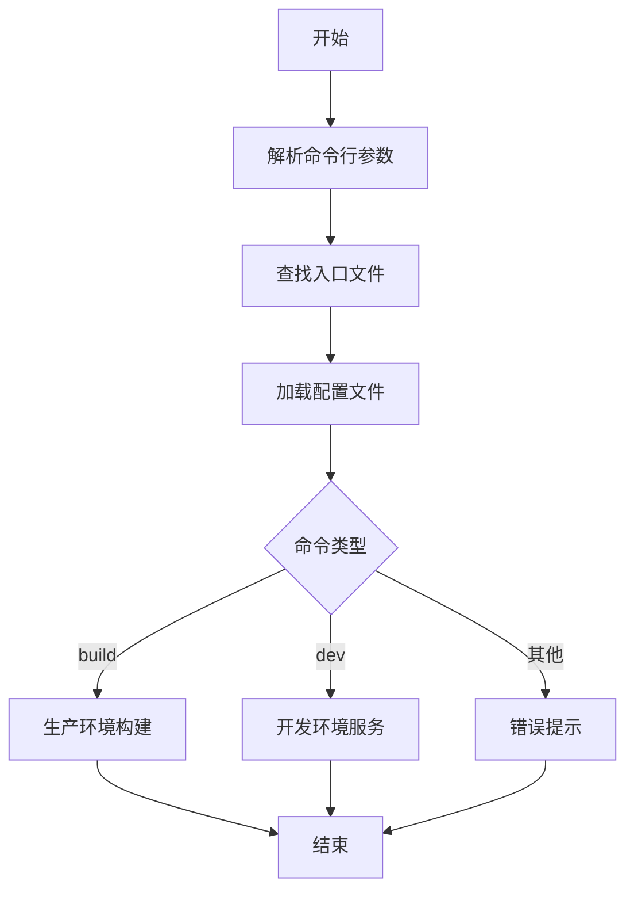
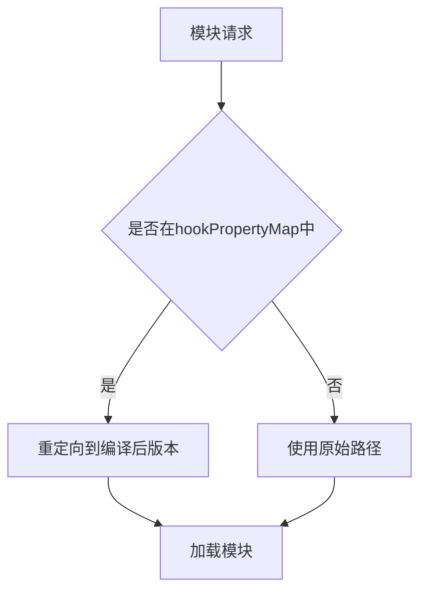
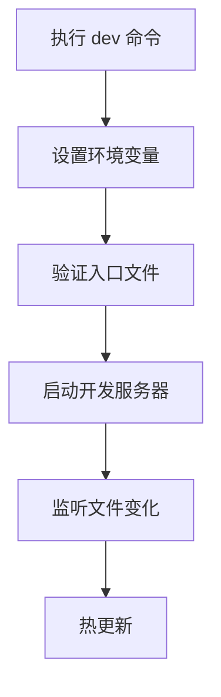
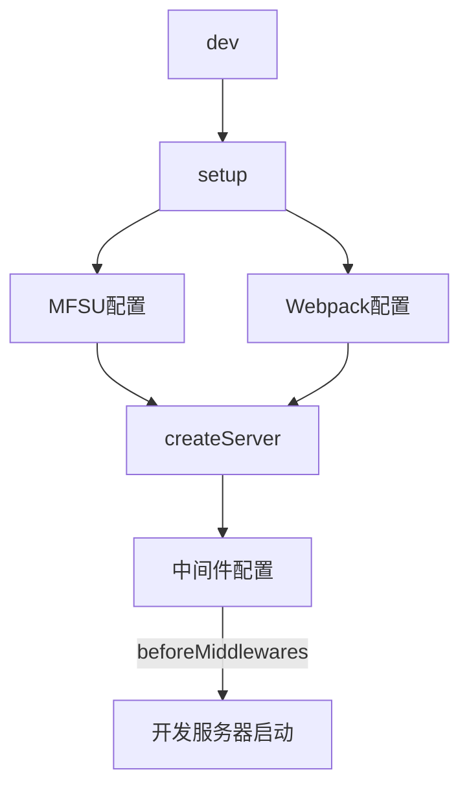
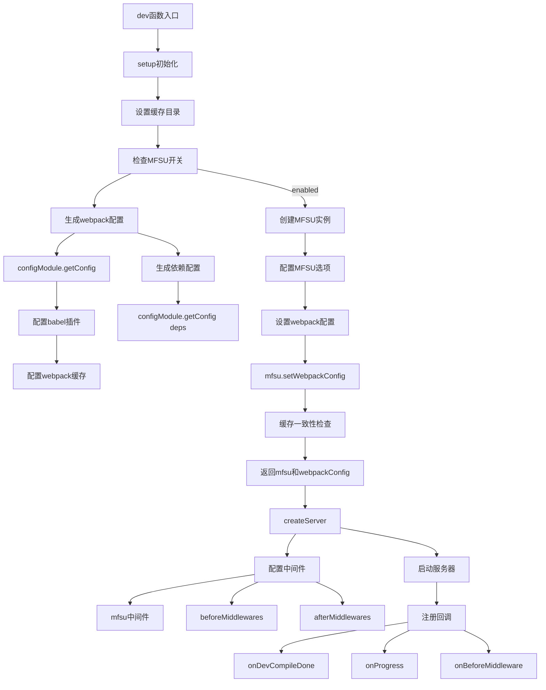
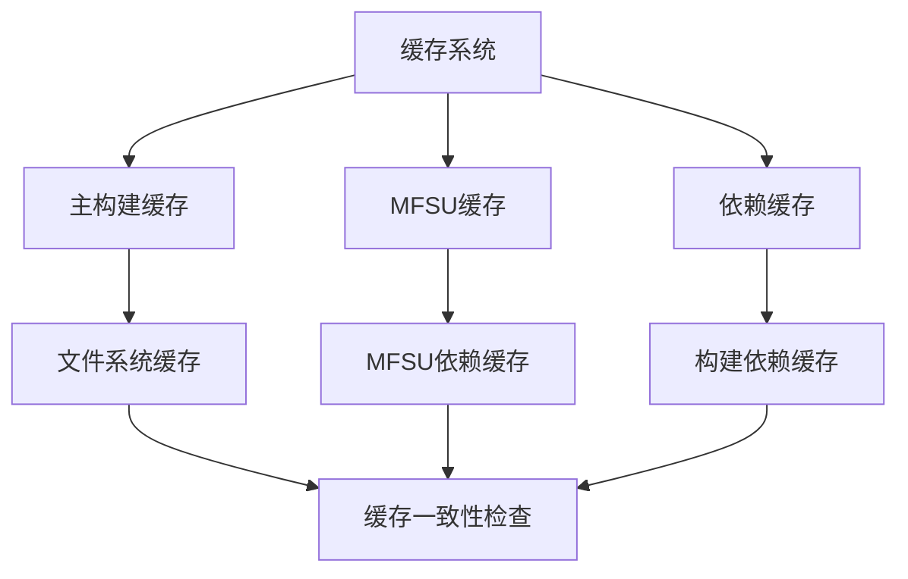
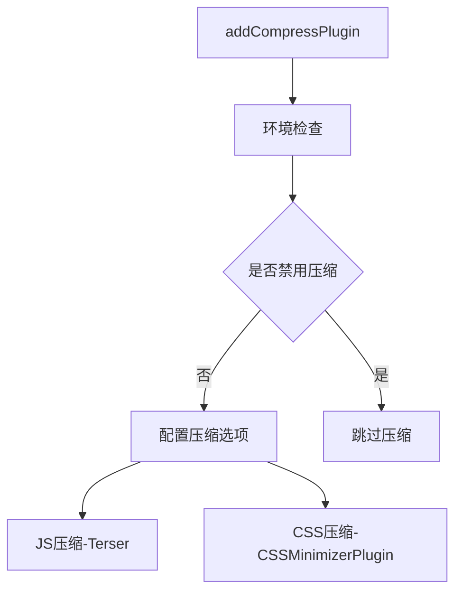
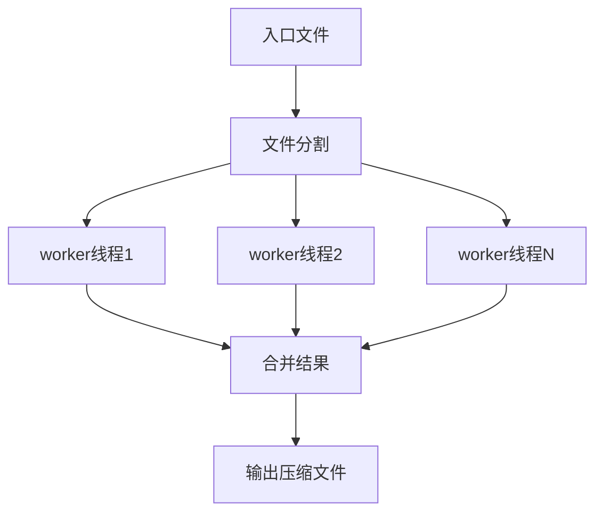

# 源码详解

**@umijs/bundler-webpack源码分析**

程序入口

```bash
  "bin": {
    "bundler-webpack": "bin/bundler-webpack.js"
  },
  
  
# bin/bundler-webpack.js
#!/usr/bin/env node
require('../dist/cli');

# src/cli.ts，打包后cli就会在dist中

import { build } from './build';
import { dev } from './dev';
```

让我分析一下这个 CLI（命令行工具）的实现：

### 1. 主要功能

该 CLI 工具提供了两个主要命令：

- `build`: 生产环境构建
- `dev`: 开发环境服务器

## 2. 代码结构分析

### 入口文件配置

```tsx
const entry = tryPaths([
  join(cwd, 'src/index.tsx'),
  join(cwd, 'src/index.ts'),
  join(cwd, 'index.tsx'),
  join(cwd, 'index.ts'),
]);

```

- 自动查找项目入口文件
- 支持 `.tsx` 和 `.ts` 两种格式
- 优先查找 src 目录下的文件

### 配置文件加载

```tsx
const configFile = resolve(cwd, args.config || 'config.ts');
register.register({
  implementor: esbuild,
});
if (existsSync(configFile)) {
  require('./requireHook');
  config = require(configFile).default;
}

```

- 默认加载 `config.ts`
- 使用 `esbuild` 编译 TypeScript
- 通过 `requireHook` 处理特殊模块加载

### 构建命令处理

```tsx
if (command === 'build') {
  (async () => {
    process.env.NODE_ENV = 'production';
    assert(entry, `Build failed: entry not found.`);
    try {
      await build({
        config,
        cwd,
        entry: {
          [getEntryKey(entry)]: entry,
        },
      });
    } catch (e) {
      console.error(e);
    }
  })();
}

```

### 开发命令处理

```tsx
else if (command === 'dev') {
  (async () => {
    process.env.NODE_ENV = 'development';
    try {
      await dev({
        config,
        cwd,
        port: process.env.PORT as number | undefined,
        entry: {
          [getEntryKey(entry)]: entry,
        },
        cache: {
          buildDependencies: [].filter(Boolean),
        },
      });
    } catch (e) {
      console.error(e);
    }
  })();
}

```

## 3. 使用示例

1. **开发环境**

```bash
bundler-webpack dev

```

2. **生产构建**

```bash
bundler-webpack build

```

3. **指定配置文件**

```bash
bundler-webpack dev --config custom.config.ts

```

## 4. 关键特性

1. **自动入口查找**
    - 无需手动指定入口文件
    - 按照约定优先级查找
2. **配置灵活性**
    - 支持自定义配置文件
    - 命令行参数覆盖配置文件
3. **错误处理**
    - 入口文件检查
    - 友好的错误提示
4. **TypeScript支持**
    - 原生支持 TypeScript
    - 使用 esbuild 编译

## 5. 工作流程



## 6. 注意事项

1. 入口文件查找顺序：
    - `src/index.tsx`
    - index.ts
    - `index.tsx`
    - `index.ts`
2. 环境变量设置：
    - `build`: NODE_ENV = 'production'
    - `dev`: NODE_ENV = 'development'
3. 配置优先级：
    - 命令行参数 > 配置文件内容

这是一个典型的前端构建工具 CLI 实现，提供了基础但完整的构建和开发功能。

## requireHook 作用分析

`requireHook` 是一个模块加载钩子，主要用于控制和定制 Node.js 的模块加载行为。在 Umi 的 webpack 打包器中，它的主要作用是：

### 1. 主要功能

1. **路径重定向**
- 将 webpack 相关模块的导入重定向到 Umi 内部编译后的版本
- 确保使用统一的 webpack 实例
1. **依赖管理**
- 处理预编译的依赖
- 避免版本冲突

### 2. 实现原理

```tsx
const mod = require('module');
const resolveFilename = mod._resolveFilename;
mod._resolveFilename = function (request, parent, isMain, options) {
  const hookResolved = hookPropertyMap.get(request);
  if (hookResolved) request = hookResolved;
  return resolveFilename.call(mod, request, parent, isMain, options);
};

```

### 3. 使用场景

1. **配置文件加载**

```tsx
if (existsSync(configFile)) {
  require('./requireHook');  // 在加载配置前注入钩子
  config = require(configFile).default;
}

```

1. **模块路径映射**

```tsx
const hookPropertyMap = new Map([
  ['webpack', resolve('compiled/webpack')],
  ['webpack/package', resolve('compiled/webpack/package')],
  // ...其他映射
]);

```

### 4. 工作流程



### 5. 优势

1. **性能优化**
    - 使用预编译的依赖
    - 减少运行时编译开销
2. **版本控制**
    - 确保依赖版本一致
    - 避免多实例问题
3. **依赖隔离**
    - 避免用户环境影响
    - 提供稳定的构建环境

### 6. 应用示例

在 CLI 中的使用：

```tsx
register.register({
  implementor: esbuild,
});
register.clearFiles();
if (existsSync(configFile)) {
  require('./requireHook');  // 注入钩子
  config = require(configFile).default;  // 加载配置
}

```

这样的设计确保了 Umi 的构建工具在不同环境下都能稳定可靠地工作。

从源码中可以看到顶部的注释

```bash
// MIT: copy from https://github.com/vercel/next.js/blob/canary/packages/next/build/webpack/require-hook.ts
// sync injects a hook for webpack and webpack/... requires to use the internal ncc webpack version
// this is in order for userland plugins to attach to the same webpack instance as umi
// the individual compiled modules are as defined for the compilation in bundles/webpack/packages/*

// 麻省理工学院：复制自https://github.com/vercel/next.js/blob/canary/packages/next/build/webpack/require-hook.ts
// sync为webpack和webpack/…注入一个钩子。。。需要使用内部ncc webpack版本
// 这是为了让userland插件与umi连接到同一个webpack实例
// 各个编译的模块与bundles/webpack/packages中的编译定义一致/*
```

拓展一下

## process.argv 参数获取说明

`process.argv` 是 Node.js 提供的获取命令行参数的方式，它是一个数组，包含了命令行中的所有参数。

### 数组内容说明

1. **第0个元素**: Node.js 执行程序的完整路径
2. **第1个元素**: 正在执行的 JavaScript 文件的路径
3. **第2个元素开始**: 命令行传入的实际参数

### 示例分析

以下面的命令为例：

```bash
bundler-webpack build --config custom.config.ts

```

`process.argv` 数组内容将是：

```tsx
[
  '/usr/local/bin/node',                    // Node.js 执行路径
  '/usr/local/bin/bundler-webpack',         // 脚本路径
  'build',                                  // 命令
  '--config',                               // 参数名
  'custom.config.ts'                        // 参数值
]

```

### 在 CLI 中的使用

在 `cli.ts` 中的处理：

```tsx
// 使用 yParser 解析命令行参数，跳过前两个元素（node路径和脚本路径）
const args = yParser(process.argv.slice(2), {});
const command = args._[0];  // 获取第一个命令参数

```

解析后的 `args` 对象结构：

```tsx
{
  _: ['build'],              // 位置参数
  config: 'custom.config.ts' // 命名参数
}

```

### 参数类型

1. **位置参数**
    - 直接传入的值
    - 存储在 `args._` 数组中
2. **命名参数**
    - 以 `-` 或  开头
    - 转换为对象属性

### 使用场景

```tsx
// 1. 获取命令
if (command === 'build') {
  // 处理构建命令
}

// 2. 获取配置文件路径
const configFile = resolve(cwd, args.config || 'config.ts');

// 3. 合并命令行参数到配置
Object.assign(config, args);

```

### 调试技巧

在开发过程中，可以打印 `process.argv` 来查看参数：

```tsx
console.log('process.argv:', process.argv);
console.log('parsed args:', args);

```

执行命令：

```bash
bundler-webpack build --debug

```

## configFile 配置文件说明

`configFile` 是一个用户自定义的配置文件，默认为 `config.ts`。通过 CLI 参数 `--config` 可以指定其他配置文件。

```tsx
const cwd = process.cwd();
let config = {};
const configFile = resolve(cwd, args.config || 'config.ts');
register.register({
  implementor: esbuild,
});
register.clearFiles();
if (existsSync(configFile)) {
  require('./requireHook'); // 注入钩子
  config = require(configFile).default; // 加载用户配置
}
Object.assign(config, args);

// 在 /Users/project/src/cli.ts 文件中

// 1. process.cwd()
console.log(process.cwd())
// 返回命令执行时的目录

// 2. __dirname
console.log(__dirname)
// 返回 /Users/project/src

// 3. __filename
console.log(__filename)
// 返回 /Users/project/src/cli.ts

// 可以看出 @umijs/bundler-webpack 是从根目录中的 config.ts 获取用配置的
```

### 配置文件示例

```tsx
import { defineConfig } from '@umijs/bundler-webpack';

export default defineConfig({
  // 基础配置
  base: '/',                    // 可选值: '/', '/app/', '/docs/'
  publicPath: '/',              // 可选值: '/', '<https://cdn.example.com/>'
  outputPath: 'dist',           // 可选值: 'dist', 'build', 'output'
  hash: true,                   // 可选值: true, false

  // 开发服务器配置
  devServer: {
    port: 8000,                // 可选值: 1024-65535
    host: 'localhost',         // 可选值: 'localhost', '0.0.0.0'
    https: false,              // 可选值: true, false
    writeToDisk: false,        // 可选值: true, false
    hot: true,                 // 可选值: true, false, 'only'
    proxy: {
      '/api': {
        target: '<http://localhost:3000>',
        changeOrigin: true,
        pathRewrite: { '^/api': '' }
      }
    }
  },

  // 构建优化配置
  optimization: {
    splitChunks: {            // 代码分割配置
      chunks: 'all',          // 可选值: 'all', 'async', 'initial'
      minSize: 30000,         // 可选值: 数字(bytes)
      minChunks: 1,          // 可选值: 数字
      automaticNameDelimiter: '.' // 可选值: 字符串
    },
    minimize: true,           // 可选值: true, false
  },

  // 浏览器兼容性配置
  targets: {
    chrome: 80,              // 可选值: 数字(版本)
    firefox: 72,             // 可选值: 数字(版本)
    safari: 13,             // 可选值: 数字(版本)
    edge: 79,               // 可选值: 数字(版本)
    ios: 10                 // 可选值: 数字(版本)
  },

  // 资源处理配置
  inlineLimit: 10000,       // 可选值: 数字(bytes)
  cssModules: {
    auto: true,             // 可选值: true, false, /\\.module\\./
    localIdentName: '[local]_[hash:base64:5]'  // 可选值: 命名模式字符串
  },

  // 性能配置
  performance: {
    hints: 'warning',       // 可选值: false, 'error', 'warning'
    maxAssetSize: 250000,  // 可选值: 数字(bytes)
    maxEntrypointSize: 250000  // 可选值: 数字(bytes)
  },

  // SourceMap 配置
  devtool: 'eval-source-map',  // 可选值: 'source-map', 'eval-source-map', false

  // 实验性功能
  experiments: {
    asyncWebAssembly: true,   // 可选值: true, false
    topLevelAwait: true,      // 可选值: true, false
  },

  // 外部依赖配置
  externals: {
    react: 'React',           // 可选值: CDN 变量名
    'react-dom': 'ReactDOM'
  },

  // 环境变量定义
  define: {
    'process.env.APP_ENV': 'production',  // 可选值: 任意字符串
    VERSION: '1.0.0'
  },

  // 别名配置
  alias: {
    '@': '/src',             // 可选值: 任意有效路径
    components: '/src/components',
    utils: '/src/utils'
  },

  // Webpack 特定配置
  chainWebpack: (config, { webpack }) => {
    // 可以直接修改 webpack 配置
    // 返回修改后的配置
    return config;
  }
});

```

### 配置说明

1. 该配置文件支持 TypeScript 类型提示
2. 使用 `defineConfig` 可以获得完整的类型检查
3. 所有配置项都是可选的，未设置时使用默认值
4. 可以根据环境变量进行条件配置

### 使用方式

1. **默认配置文件**:

```bash
bundler-webpack dev
```

1. **指定配置文件**:

```bash
bundler-webpack dev --config custom.config.ts
```

1. **使用环境变量**:

```bash
NODE_ENV=production bundler-webpack build
```

这里展开说一下开发配置和生产配置

## dev 命令详细说明

dev 命令用于启动开发服务器，让我详细解析其实现和使用：

### 命令执行流程



### 代码解析

```tsx
else if (command === 'dev') {
  (async () => {
    // 1. 设置环境变量
    process.env.NODE_ENV = 'development';

    try {
      // 2. 验证入口文件
      assert(entry, `Build failed: entry not found.`);

      // 3. 启动开发服务器
      await dev({
        // 配置对象
        config,
        // 当前工作目录
        cwd,
        // 服务器端口
        port: process.env.PORT as number | undefined,
        // 入口文件配置
        entry: {
          [getEntryKey(entry)]: entry,
        },
        // 缓存配置
        cache: {
          buildDependencies: [].filter(Boolean),
        },
      });
    } catch (e) {
      console.error(e);
    }
  })();
}

```

### 启动参数说明

### 1. 基础参数

- `config`: webpack 配置对象
- `cwd`: 当前工作目录
- `port`: 开发服务器端口号
- `entry`: 入口文件配置

### 2. 可选参数

```tsx
interface DevOptions {
  port?: number;             // 端口号，默认 8000
  host?: string;            // 主机名，默认 localhost
  https?: boolean;          // 是否启用 HTTPS
  open?: boolean;           // 是否自动打开浏览器
  writeToDisk?: boolean;    // 是否写入磁盘
}
```

### 使用方式

1. **基本使用**
    
    ```bash
    bundler-webpack dev
    ```
    
2. **指定端口**
    
    ```bash
    PORT=3000 bundler-webpack dev
    ```
    
3. **指定配置文件**
    
    ```bash
    bundler-webpack dev --config custom.config.ts
    ```
    
4. **自定义配置示例**
    
    ```tsx
    export default {
      devServer: {
        port: 8000,
        host: 'localhost',
        https: false,
        open: true,
        proxy: {
          '/api': {
            target: '<http://localhost:3000>',
            changeOrigin: true
          }
        }
      }
    }
    ```
    

### 开发服务器特性

1. **热更新 (HMR)**
    - 支持实时模块替换
    - 无需刷新页面即可更新
2. **代理配置**
    - 支持接口代理
    - 解决跨域问题
3. **静态资源服务**
    - 自动处理静态资源
    - 支持各类资源的实时编译
4. **错误处理**
    - 友好的错误提示
    - 支持错误覆盖层

### 开发过程中的调试技巧

1. **查看webpack配置**
    
    ```bash
    NODE_ENV=development DEBUG=webpack bundler-webpack dev
    ```
    
2. **开启详细日志**
    
    ```bash
    VERBOSE=1 bundler-webpack dev
    ```
    
3. **监控内存使用**
    
    ```bash
    NODE_OPTIONS="--max-old-space-size=4096" bundler-webpack dev
    ```
    

### 常见问题处理

1. **端口冲突**
    - 自动寻找可用端口
    - 可通过 PORT 环境变量指定
2. **内存溢出**
    - 增加 Node.js 内存限制
    - 优化构建配置
3. **HMR 失效**
    - 检查模块是否支持 HMR
    - 验证 webpack 配置

dev展开详谈

# `src/dev.ts` 源码分析

## 主要功能

该文件实现了 Umi 的开发服务器功能，主要包含两个核心函数：

1. `dev()`: 启动开发服务器
2. `setup()`: 配置初始化

## 文件结构





挖坑：MFSU先不展开说，随后开专题

## 关键配置接口

```tsx
type IOpts = {
  // 中间件相关
  afterMiddlewares?: any[];
  beforeMiddlewares?: any[];

  // 生命周期钩子
  onDevCompileDone?: Function;
  onProgress?: Function;
  onMFSUProgress?: Function;

  // 服务器配置
  port?: number;
  host?: string;
  ip?: string;

  // Babel 配置
  babelPreset?: any;
  beforeBabelPlugins?: any[];
  beforeBabelPresets?: any[];
  extraBabelPlugins?: any[];
  extraBabelPresets?: any[];

  // Webpack 配置
  chainWebpack?: Function;
  modifyWebpackConfig?: Function;

  // 路径相关
  cwd: string;
  rootDir?: string;

  // MFSU 配置
  mfsuStrategy?: 'eager' | 'normal';
  mfsuInclude?: string[];

  // 其他配置
  config: IConfig;
  entry: Record<string, string>;
  disableCopy?: boolean;
} & Pick<IConfigOpts, 'cache' | 'pkg'>;

```

## 核心功能分析

### 1. dev 函数

```tsx
export async function dev(opts: IOpts) {
  // 1. 初始化配置
  const { mfsu, webpackConfig } = await setup(opts);

  // 2. 创建开发服务器
  await createServer({
    webpackConfig,
    userConfig: opts.config,
    cwd: opts.cwd,
    beforeMiddlewares: [
      ...(mfsu?.getMiddlewares() || []),
      ...(opts.beforeMiddlewares || []),
    ],
    // ...其他配置
  });
}

```

### 2. setup 函数功能

1. **缓存目录设置**

```tsx
const cacheDirectoryPath = resolve(
  opts.rootDir || opts.cwd,
  opts.config.cacheDirectoryPath || 'node_modules/.cache'
);

// 也确实可以看到缓存 node_modules/.cache
node_modules/.cache/
├── bundler-webpack/
│   └── default-development/    # webpack开发环境的构建缓存  二进制文件
├── logger/                     # 日志缓存
├── mfsu/                      # MFSU(Module Federation Speed Up)主要缓存
│   ├── main.1981a92c.js       # MFSU生成的主文件
│   └── mf_index.js            # MFSU入口文件
└── mfsu-deps/                 # MFSU依赖缓存
    └── MFSU-development/      # MFSU开发环境缓存         二进制文件
```

1. **MFSU 配置**
    - Module Federation 静态化
    - 依赖预编译
    - 缓存管理
2. **Webpack 配置生成**
    - 基础配置
    - 开发环境特定配置
    - 依赖配置

### 重要特性

1. **MFSU (Module Federation Static Usage)**
    
    ```tsx
    if (enableMFSU) {
      mfsu = new MFSU({
        strategy: opts.mfsuStrategy,                    // 策略：eager或normal
        include: opts.mfsuInclude || [],               // 包含的模块
        buildDepWithESBuild: opts.config.mfsu?.esbuild, // 是否使用esbuild
        // ...其他MFSU配置
      });
    }
    ```
    
2. **缓存处理**
    
    ```tsx
    if (webpackConfig.cache &&
        typeof webpackConfig.cache === 'object' &&
        webpackConfig.cache.type === 'filesystem') {
        // 缓存一致性检查
    }
    ```
    
3. **中间件管理**
    
    ```tsx
    beforeMiddlewares: [
      ...(mfsu?.getMiddlewares() || []),
      ...(opts.beforeMiddlewares || [])
    ]
    ```
    

### 使用示例

```tsx
// 基础使用
await dev({
  cwd: process.cwd(),
  config: {
    // 用户配置
  },
  entry: {
    main: './src/index.ts'
  }
});

// 带完整配置的使用
await dev({
  cwd: process.cwd(),
  config: {
    mfsu: {
      strategy: 'eager',
      esbuild: true
    }
  },
  port: 8000,
  host: 'localhost',
  beforeMiddlewares: [
    // 自定义中间件
  ],
  onDevCompileDone: (stats) => {
    // 编译完成回调
  }
});
```

### 调试技巧

1. **查看 MFSU 缓存**
    
    ```bash
    ls node_modules/.cache/mfsu
    ```
    
2. **开启调试日志**
    
    ```bash
    DEBUG=umi:bundler:webpack:dev npm run dev
    ```
    
3. **监控内存使用**
    
    ```bash
    NODE_OPTIONS="--max-old-space-size=4096" npm run dev
    ```
    

补充一点高级用法

```tsx
webpackConfig.resolve!.alias ||= {};

// 是 TypeScript 中的语法组合，包含了几个关键特性：
// 1. 非空断言操作符 !
// 告诉 TypeScript 编译器 resolve 一定不是 undefined
webpackConfig.resolve!

// 2. 逻辑或赋值操作符 ||=
// 等同于
webpackConfig.resolve!.alias = webpackConfig.resolve!.alias || {};

// 等效代码
if (!webpackConfig.resolve.alias) {
  webpackConfig.resolve.alias = {};
}
```

## webpack 缓存构建分析

在 Umi 的 webpack 打包器中，缓存系统主要通过以下几个部分构建：

### 1. 缓存目录设置

```tsx
const cacheDirectoryPath = resolve(
  opts.rootDir || opts.cwd,
  opts.config.cacheDirectoryPath || 'node_modules/.cache',
);

```

### 2. 缓存配置结构

主要分为三类缓存：

### 2.1 主构建缓存

```tsx
cache: opts.cache ? {
  ...opts.cache,
  cacheDirectory: join(
    cacheDirectoryPath,
    opts.mfsuStrategy === 'eager'
      ? 'bundler-webpack-eager'
      : 'bundler-webpack'
  ),
} : undefined

```

### 2.2 MFSU 缓存

```tsx
mfsu = new MFSU({
  // ...其他配置
  tmpBase: opts.config.mfsu?.cacheDirectory ||
    join(cacheDirectoryPath, 'mfsu'),
  getCacheDependency() {
    return ensureSerializableValue({
      version: require('../package.json').version,
      mfsu: opts.config.mfsu,
      alias: opts.config.alias,
      externals: opts.config.externals,
      theme: opts.config.theme,
      runtimePublicPath: opts.config.runtimePublicPath,
      publicPath: opts.config.publicPath,
      define: opts.config.define,
    });
  }
});

```

### 2.3 依赖缓存

```tsx
cache: {
  buildDependencies: opts.cache?.buildDependencies,
  cacheDirectory: join(cacheDirectoryPath, 'mfsu-deps')
}

```

### 3. 缓存一致性检查

```tsx
if (mfsu && webpackConfig.cache &&
    typeof webpackConfig.cache === 'object' &&
    webpackConfig.cache.type === 'filesystem') {

  // 获取 webpack 缓存路径
  const webpackCachePath = join(
    webpackConfig.cache.cacheDirectory!,
    `default-development`,
    'index.pack'
  );

  // 检查缓存是否存在
  const mfsuCacheExists = existsSync(mfsu.getCacheFilePath());
  const webpackCacheExists = existsSync(webpackCachePath);

  // 如果 webpack 缓存存在但 MFSU 缓存丢失，清理 webpack 缓存
  if (webpackCacheExists && !mfsuCacheExists) {
    logger.warn(`Invalidate webpack cache since mfsu cache is missing`);
    rimraf.sync(webpackConfig.cache.cacheDirectory!);
  }
}

```

### 4. 缓存目录结构

```
node_modules/.cache/
├── bundler-webpack/           # 普通模式的主构建缓存
├── bundler-webpack-eager/    # eager 模式的主构建缓存
├── mfsu/                     # MFSU 缓存
└── mfsu-deps/               # 依赖缓存

```

### 5. 缓存依赖处理



通过这种多层缓存机制，Umi 实现了：

1. **构建加速**：通过文件系统缓存减少重复编译
2. **依赖优化**：MFSU 缓存提升依赖处理效率
3. **增量构建**：只构建发生变化的部分
4. **缓存一致性**：自动检测和清理不一致的缓存

这里的缓存就是webpack的功能了，

[https://webpack.docschina.org/configuration/cache/#cache](https://webpack.docschina.org/configuration/cache/#cache)

https://webpack.js.org/configuration/cache/#cache

Webpack 的缓存配置可以帮助提高构建性能，特别是在开发过程中。下面是对该部分内容的概述和解释，特别是如何配置 Webpack 的缓存选项。

## Webpack 缓存配置

在 Webpack 中，缓存可以通过多种方式进行配置，以优化构建时间和开发体验。以下是如何配置缓存的具体步骤和参数说明：

### 基本配置

在 Webpack 配置文件（通常是 `webpack.config.js`）中，可以通过 `cache` 选项来启用和配置缓存。

```jsx
module.exports = {
  // 其他配置...
  cache: {
    type: 'filesystem', // 使用文件系统缓存
  },
};

```

- **`type`**: 指定缓存类型。可选值有 `'memory'` 和 `'filesystem'`。默认是 `'memory'`，即内存缓存。使用 `'filesystem'` 可以显著提升大型项目的重建速度。

### 文件系统缓存配置

当设置 `type: 'filesystem'` 时，可以进一步配置缓存的行为：

```jsx
module.exports = {
  // 其他配置...
  cache: {
    type: 'filesystem',
    buildDependencies: {
      // 当这些依赖发生变化时，缓存将被视为无效
      config: [__filename],
    },
    version: '1.0.0', // 自定义版本号，用于区分不同的缓存配置
    cacheDirectory: path.resolve(__dirname, '.temp_cache'), // 缓存存储目录
    store: 'pack', // 存储格式：'pack' 或 'pack'，'pack' 更高效
    name: 'custom-cache-name', // 自定义缓存名称
    profile: false, // 是否收集缓存性能数据，默认为 false
    idleTimeout: 60000, // 空闲超时时间，单位毫秒
    idleTimeoutForInitialStore: 5000, // 初始存储空闲超时时间，单位毫秒
    maxAge: 1000 * 60 * 60 * 24, // 缓存的最大存活时间，单位毫秒
    compression: true, // 是否启用压缩，默认为 true
  },
};

```

### 参数说明

- **`buildDependencies`**: 指定哪些文件或模块的变化会导致缓存失效。通常包括 Webpack 配置文件本身。
- **`version`**: 自定义版本号，用于区分不同的缓存配置。如果更改了 Webpack 配置或其他重要设置，建议更新版本号以确保缓存被正确刷新。
- **`cacheDirectory`**: 指定缓存存储的目录。默认情况下，Webpack 会使用操作系统的临时目录。
- **`store`**: 指定缓存的存储格式。`'pack'` 格式更高效，适合大多数场景。
- **`name`**: 自定义缓存名称，便于管理和调试。
- **`profile`**: 是否收集缓存性能数据，主要用于调试目的。
- **`idleTimeout`**: 缓存空闲超时时间，在此时间内没有新的构建请求，缓存会被关闭。
- **`idleTimeoutForInitialStore`**: 初始存储空闲超时时间，适用于首次存储缓存的情况。
- **`maxAge`**: 缓存的最大存活时间，超过这个时间后缓存将自动过期。
- **`compression`**: 是否启用压缩以节省磁盘空间，默认为 `true`。

### 实际应用示例

假设你正在开发一个大型项目，并希望利用文件系统缓存来加速构建过程。以下是一个完整的示例配置：

```jsx
const path = require('path');

module.exports = {
  entry: './src/index.js',
  output: {
    filename: 'bundle.js',
    path: path.resolve(__dirname, 'dist'),
  },
  module: {
    rules: [
      // 加载器规则
    ],
  },
  plugins: [
    // 插件列表
  ],
  cache: {
    type: 'filesystem',
    buildDependencies: {
      config: [__filename],
    },
    version: '1.0.0',
    cacheDirectory: path.resolve(__dirname, '.temp_cache'),
    store: 'pack',
    name: 'my-custom-cache',
    profile: false,
    idleTimeout: 60000,
    idleTimeoutForInitialStore: 5000,
    maxAge: 1000 * 60 * 60 * 24,
    compression: true,
  },
};

```

### 总结

通过合理配置 Webpack 的缓存选项，特别是使用文件系统缓存，可以显著提升开发效率和构建速度。根据你的具体需求，调整相关参数以达到最佳效果。如果你遇到任何问题或需要进一步的帮助，请随时告诉我！

[**cache.buildDependencies**](https://webpack.docschina.org/configuration/cache/#cachebuilddependencies)

webpack config是 **webpack-5-chain** 生成的

**webpack-5-chain** 又是 **[webpack-chain](https://github.com/Yatoo2018/webpack-chain) 构建的包，元起** [webpack-chain](https://github.com/neutrinojs/webpack-chain) 这个项目。

作用就是链式创建config

```jsx
// Require the webpack-chain module. This module exports a single
// constructor function for creating a configuration API.
const Config = require('webpack-chain');

// Instantiate the configuration with a new API
const config = new Config();

// Make configuration changes using the chain API.
// Every API call tracks a change to the stored configuration.

config
  // Interact with entry points
  .entry('index')
    .add('src/index.js')
    .end()
  // Modify output settings
  .output
    .path('dist')
    .filename('[name].bundle.js');
    
// Create named plugins too!
config
  .plugin('clean')
    .use(CleanPlugin, [['dist'], { root: '/dir' }]);

// Export the completed configuration object to be consumed by webpack
module.exports = config.toConfig();
    
// webpack.core.js
const Config = require('webpack-chain');
const config = new Config();

// Make configuration shared across targets
// ...

module.exports = config;

// webpack.dev.js
const config = require('./webpack.core');

// Dev-specific configuration
// ...
module.exports = config.toConfig();

// webpack.prod.js
const config = require('./webpack.core');

// Production-specific configuration
// ...
module.exports = config.toConfig();

```

## `src/config/config.ts`

```tsx
export async function getConfig(opts: IOpts): Promise<Configuration> {
  const { userConfig } = opts;
  const isDev = opts.env === Env.development;
  const config = new Config();
  userConfig.targets ||= DEFAULT_BROWSER_TARGETS;
  // normalize inline limit

  // devtool
  config.devtool(
    isDev
      ? userConfig.devtool === false
        ? false
        : userConfig.devtool || DEFAULT_DEVTOOL
      : userConfig.devtool!,
  );

  // node polyfill
  await addNodePolyfill(applyOpts);

  // rules
  await addJavaScriptRules(applyOpts);
  await addCSSRules(applyOpts);
  await addAssetRules(applyOpts);
  await addSVGRules(applyOpts);

  // plugins
  // mini-css-extract-plugin
  await addMiniCSSExtractPlugin(applyOpts);
  // ignoreMomentLocale
  await addIgnorePlugin(applyOpts);
  // define
  await addDefinePlugin(applyOpts);
  // fast refresh
  await addFastRefreshPlugin(applyOpts);
  // progress
  await addProgressPlugin(applyOpts);
  // detect-dead-code-plugin
  await addDetectDeadCodePlugin(applyOpts);
  // fork-ts-checker
  await addForkTSCheckerPlugin(applyOpts);
  // copy
  if (!opts.disableCopy) {
    await addCopyPlugin(applyOpts);
  }
  // manifest
  await addManifestPlugin(applyOpts);
  // hmr
  if (isDev && opts.hmr) {
    config.plugin('hmr').use(webpack.HotModuleReplacementPlugin);
  }
  // ssr
  await addSSRPlugin(applyOpts);
  // compress
  await addCompressPlugin(applyOpts);
  // purgecss
  // await applyPurgeCSSWebpackPlugin(applyOpts);
  // handle HarmonyLinkingError
  await addHarmonyLinkingErrorPlugin(applyOpts);
  // remove node: prefix
  // disable for performance
  // await addNodePrefixPlugin(applyOpts);
  // prevent runtime error due to css module in node modules.
  await addDependenceCssModulesDetector(applyOpts);
  // runtimePublicPath
  if (userConfig.runtimePublicPath) {
    config.plugin('runtimePublicPath').use(RuntimePublicPathPlugin);
  }
  // case-sensitive-paths
  config.plugin('case-sensitive-paths').use(CaseSensitivePaths);

  // cache
  if (opts.cache) {
    config.cache({
      type: 'filesystem',
      version: require('../../package.json').version,
      buildDependencies: {
        config: opts.cache.buildDependencies || [],
      },
      cacheDirectory:
        opts.cache.cacheDirectory ||
        // 使用 rootDir 是在有 APP_ROOT 时，把 cache 目录放在根目录下
        join(
          opts.rootDir || opts.cwd,
          'node_modules',
          '.cache',
          'bundler-webpack',
        ),
    });

  // analyzer
  if (opts.analyze) {
    await addBundleAnalyzerPlugin(applyOpts);
  }

  // chain webpack
  if (opts.chainWebpack) {
    await opts.chainWebpack(config, {
      env: opts.env,
      webpack,
    });
  }
  if (userConfig.chainWebpack) {
    await userConfig.chainWebpack(config, {
      env: opts.env,
      webpack,
    });
  }

  let webpackConfig = config.toConfig();

  // speed measure
  webpackConfig = await addSpeedMeasureWebpackPlugin({
    webpackConfig,
  });

  if (opts.modifyWebpackConfig) {
    webpackConfig = await opts.modifyWebpackConfig(webpackConfig, {
      env: opts.env,
      webpack,
    });
  }

  return webpackConfig;
}
```

这里以`addSVGRules` 和`addCompressPlugin` 作为示例讲解

### `addSVGRules`

```tsx
// addSVGRules

export async function addSVGRules(opts: IOpts) {
  const { config, userConfig } = opts;
  const { svgr, svgo = {} } = userConfig;
  if (svgr) {
    const svgrRule = config.module.rule('svgr');
    svgrRule
      .test(/\.svg$/)
      .issuer(/\.[jt]sx?$/)
      .type('javascript/auto')
      .use('svgr-loader')
      .loader(require.resolve('../loader/svgr'))
      .options({
        svgoConfig: {
          plugins: [
            {
              name: 'preset-default',
              params: {
                overrides: {
                  removeTitle: false,
                },
              },
            },
            'prefixIds',
          ],
          ...svgo,
        },
        ...svgr,
        svgo: !!svgo,
      })
      .end()
      .use('url-loader')
      .loader(require.resolve('@umijs/bundler-webpack/compiled/url-loader'))
      .options({
        limit: userConfig.inlineLimit,
        fallback: require.resolve(
          '@umijs/bundler-webpack/compiled/file-loader',
        ),
      })
      .end();
  }
  if (svgo !== false) {
    const svgRule = config.module.rule('svg');
    svgRule
      .test(/\.svg$/)
      .use('svgo-loader')
      .loader(require.resolve('@umijs/bundler-webpack/compiled/svgo-loader'))
      .options({ configFile: false, ...svgo })
      .end();
  }
}
```

让我解释为什么 Umi 在这里单独处理 SVG 而不是直接使用 @svgr/webpack：

### 自定义 `src/loader/svgr.ts`

1. **性能优化**
    
    ```mermaid
    graph TD
        A[SVG源文件] --> B[解析导出语句]
        B --> C{是否已有导出?}
        C -->|是| D[读取文件]
        C -->|否| E[直接转换]
        D --> F[SVG转换]
        E --> F
        F --> G[esbuild转换]
    
    ```
    
2. **预编译和依赖控制**
    
    ```tsx
    // TODO: prebuild @svgr/core @svgr/plugin-jsx @svgr/plugin-svgo
    import { Config, State, transform } from '@svgr/core';
    ```
    
    - 可以预编译 `@svgr` 相关依赖
    - 减少运行时依赖
    - 控制依赖版本
3. **增加 esbuild 支持**
    
    ```tsx
    const tranformSvg = callbackify(
      async (contents: string, options: Config, state: Partial<State>) => {
        // 1. 先用 svgr 转换
        const jsCode = await transform(contents, options, state);
        // 2. 再用 esbuild 处理
        const result = await defaultEsbuildTransform(jsCode, {
          loader: 'tsx',
          target: 'es2015',
        });
        return result.code;
      }
    );
    
    ```
    
4. **导出语法兼容**
    
    ```tsx
    const previousExport = (() => {
      // 处理 export 语法
      if (contents.startsWith('export ')) return contents;
      // 处理 module.exports 语法
      const exportMatches = contents.match(/^module.exports\\s*=\\s*(.*)/);
      return exportMatches ? `export default ${exportMatches[1]}` : null;
    })();
    
    ```
    

### `loader/svgr.ts`主要优势

1. **构建性能**
    - 使用 esbuild 加速转换
    - 避免重复处理
2. **更好的控制**
    - 自定义转换流程
    - 灵活的配置选项
3. **兼容性处理**
    - 支持多种导出语法
    - 统一输出格式
4. **集成优化**
    - 与 Umi 构建流程深度集成
    - 更好的缓存控制

这种自定义实现让 Umi 能够：

- 更好地控制 SVG 处理流程
- 提供更好的构建性能
- 实现更深度的优化
- 保持与整体构建系统的一致性

### addCompressPlugin

- code
    
    ```tsx
    export async function addCompressPlugin(opts: IOpts) {
      const { config, userConfig, env } = opts;
      const jsMinifier = userConfig.jsMinifier || JSMinifier.esbuild;
      const cssMinifier = userConfig.cssMinifier || CSSMinifier.esbuild;
    
      if (
        env === Env.development ||
        process.env.COMPRESS === 'none' ||
        (jsMinifier === JSMinifier.none && cssMinifier === CSSMinifier.none)
      ) {
        config.optimization.minimize(false);
        return;
      }
      config.optimization.minimize(true);
    
      // esbuild transform only allow `string[]` as target
      const esbuildTarget = getEsBuildTarget({
        targets: userConfig.targets || {},
        jsMinifier,
      });
      // 提升 esbuild 压缩产物的兼容性，比如不出现 ?? 这种语法
      if (!esbuildTarget.includes('es2015')) {
        esbuildTarget.push('es2015');
      }
    
      let minify: any;
      let terserOptions: IConfig['jsMinifierOptions'];
      if (jsMinifier === JSMinifier.esbuild) {
        minify = TerserPlugin.esbuildMinify;
        terserOptions = {
          target: esbuildTarget,
          // remove all comments
          legalComments: 'none',
        } as EsbuildOpts;
        // 解决 esbuild 压缩命名冲突 需要用户主动开启
        if (userConfig.esbuildMinifyIIFE) {
          config.plugin('EsbuildMinifyFix').use(EsbuildMinifyFix);
        }
      } else if (jsMinifier === JSMinifier.terser) {
        minify = TerserPlugin.terserMinify;
        terserOptions = {
          format: {
            comments: false,
          },
        } as TerserOptions;
      } else if (jsMinifier === JSMinifier.swc) {
        minify = TerserPlugin.swcMinify;
      } else if (jsMinifier === JSMinifier.uglifyJs) {
        minify = TerserPlugin.uglifyJsMinify;
        terserOptions = {
          output: {
            comments: false,
          },
        };
      } else if (jsMinifier !== JSMinifier.none) {
        throw new Error(`Unsupported jsMinifier ${userConfig.jsMinifier}.`);
      }
      terserOptions = {
        ...terserOptions,
        ...userConfig.jsMinifierOptions,
      };
      if (jsMinifier !== JSMinifier.none) {
        config.optimization.minimizer(`js-${jsMinifier}`).use(TerserPlugin, [
          {
            extractComments: false,
            minify,
            terserOptions,
          },
        ] as any);
      }
    
      let cssMinify: any;
      let minimizerOptions: IConfig['cssMinifierOptions'];
      if (cssMinifier === CSSMinifier.esbuild) {
        cssMinify = CSSMinimizerWebpackPlugin.esbuildMinify;
        minimizerOptions = {
          target: esbuildTarget,
        } as EsbuildOpts;
      } else if (cssMinifier === CSSMinifier.cssnano) {
        cssMinify = CSSMinimizerWebpackPlugin.cssnanoMinify;
      } else if (cssMinifier === CSSMinifier.parcelCSS) {
        cssMinify = CSSMinimizerWebpackPlugin.lightningCssMinify;
      } else if (cssMinifier !== CSSMinifier.none) {
        throw new Error(`Unsupported cssMinifier ${userConfig.cssMinifier}.`);
      }
      minimizerOptions = {
        ...minimizerOptions,
        ...userConfig.cssMinifierOptions,
      };
      config.optimization
        .minimizer(`css-${cssMinifier}`)
        .use(CSSMinimizerWebpackPlugin, [
          {
            minify: cssMinify,
            minimizerOptions,
          },
        ]);
    }
    ```
    

`addCompressPlugin` 是 Umi 中用于代码压缩的配置插件，它的主要设计原理如下：

### 1. 基本设计原则



### 2. 核心实现

```tsx
export async function addCompressPlugin(opts: IOpts) {
  const { config, userConfig } = opts;

  // 1. 环境检查
  const disableCompress = process.env.COMPRESS === 'none';
  if (disableCompress) return;

  // 2. JS压缩配置
  config.optimization
    .minimize(true)
    .minimizer('js')
    .use(TerserPlugin, [{
      // terser配置
      terserOptions: {
        compress: {
          ecma: 5,
          // ...其他压缩选项
        }
      }
    }]);

  // 3. CSS压缩配置
  config.optimization
    .minimizer('css')
    .use(CssMinimizerPlugin, [{
      // css压缩选项
      minimizerOptions: {
        preset: ['default', {
          minifyFontValues: { removeQuotes: false }
        }]
      }
    }]);
}

```

### 3. 设计特点

1. **可配置性**
    - 支持环境变量控制
    - 支持用户自定义配置
    - 灵活的压缩选项
2. **分类处理**

```tsx
// JS压缩 - 使用 Terser
minimizer('js').use(TerserPlugin)

// CSS压缩 - 使用 CssMinimizerPlugin
minimizer('css').use(CssMinimizerPlugin)

```

1. **优化策略**
    - 生产环境自动开启
    - 开发环境可选关闭
    - 支持并行处理

### 4. 配置示例

```tsx
// .umirc.ts
export default {
  compress: {
    // Terser 配置
    terserOptions: {
      compress: {
        drop_console: true,
      }
    },
    // CSS 压缩配置
    cssOptions: {
      minifyFontValues: {
        removeQuotes: false
      }
    }
  }
}

```

### 5. 工作流程

1. **初始化检查**
    
    ```tsx
    const disableCompress = process.env.COMPRESS === 'none';
    if (disableCompress) return;
    
    ```
    
2. **配置合并**
    
    ```tsx
    const terserOptions = {
      ...defaultTerserOptions,
      ...userConfig.terserOptions
    };
    
    ```
    
3. **插件配置**
    
    ```tsx
    config.optimization
      .minimize(true)
      .minimizer('js')
      .use(TerserPlugin, [options]);
    
    ```
    

### 6. 性能考虑

1. **并行处理**
    - 支持多进程压缩
    - 提高构建速度
2. **缓存策略**
    - 支持压缩结果缓存
    - 减少重复压缩
3. **资源过滤**
    - 可配置不压缩的文件
    - 支持条件压缩

### 7. 使用场景

1. **生产环境构建**
    
    ```bash
    COMPRESS=none umi build  # 禁用压缩
    ```
    
2. **自定义压缩配置**
    
    ```tsx
    // config.ts
    export default {
      compress: {
        targets: ['*.js', '*.css'],
        exclude: ['vendor.js']
      }
    }
    
    ```
    
3. **特定需求适配**
    
    ```tsx
    // 配置特定的压缩选项
    terserOptions: {
      format: {
        comments: false
      }
    }
    
    ```
    

## Terser 多进程压缩分析

[https://webpack.docschina.org/configuration/optimization/#optimizationminimizer](https://webpack.docschina.org/configuration/optimization/#optimizationminimizer)

在 compressPlugin.ts 中，多进程压缩是通过 `TerserPlugin` 的默认配置实现的。让我解释具体实现：

### 1. 多进程配置

```tsx
config.optimization.minimizer(`js-${jsMinifier}`).use(TerserPlugin, [
  {
    extractComments: false,
    minify,
    terserOptions,
    // 默认配置中包含了并行处理
    parallel: true,  // 这个配置是 TerserPlugin 默认开启的
  },
]);

```

### 2. TerserPlugin 的并行处理原理



### 3. 默认的并行配置

- `parallel: true` - 启用多进程
- 线程数默认为 `os.cpus().length - 1`
- 可以通过数字指定具体线程数

## 总结：

`@umijs/bundler-webpack` 预设了很多`loader` 具体可以看`compiled` 目录下。

`src/cli.ts` 是程序入口，根据`NODE_ENV` 区分开发环境和生成环境。

分别使用`src/dev.ts`和`src/build.ts` 生成不同环境下的`webpackConfig` 。

具体是通过`src/config/config.ts`中的`getConfig`方法，

`getConfig`调用`src/config`每个`loader`，使用各自`loader`的`webpack-chain` 进行链式修改，最后返回一个`webpackConfig`

`src/dev.ts`中使用`createServer()` 启动webpack服务

`src/build.ts`通过`const compiler = webpack(webpackConfig);`创建了**Compiler 实例，进行打包。**

`createServer()` 是一个`express()`  服务

- 请求html
    
    ```tsx
      // index.html
      // TODO: remove me
      app.get('/', (_req, res, next) => {
        res.set('Content-Type', 'text/html');
        const htmlPath = join(opts.cwd, 'index.html');
        if (existsSync(htmlPath)) {
          createReadStream(htmlPath).on('error', next).pipe(res);
        } else {
          next();
        }
      });
    ```
    
- 请求css
    
    ### 1. 核心功能
    
    `webpackDevMiddleware` 是一个 Express 风格的中间件，主要提供以下功能：
    
    ```mermaid
    graph TD
        A[webpackDevMiddleware] --> B[内存文件系统]
        A --> C[自动编译]
        A --> D[热更新支持]
        A --> E[开发服务]
    
        B --> F[快速访问]
        C --> G[监听文件变化]
        D --> H[实时更新]
        E --> I[资源访问]
    
    ```
    
    ### 2. 具体实现
    
    在 Umi 中的配置：
    
    ```tsx
    const compilerMiddleware = webpackDevMiddleware(compiler, {
      // 资源访问路径前缀
      publicPath: userConfig.publicPath || '/',
      // 是否写入磁盘
      writeToDisk: userConfig.writeToDisk,
      // 统计信息输出
      stats: 'none'
    });
    
    ```
    
    ### 3. 工作流程
    
    ```mermaid
    sequenceDiagram
        Browser->>Middleware: 请求资源
        Middleware->>Memory FS: 检查内存文件系统
        Memory FS-->>Middleware: 返回文件
        Middleware->>Webpack: 文件不存在，触发编译
        Webpack-->>Memory FS: 编译完成，存储文件
        Memory FS-->>Middleware: 返回新编译的文件
        Middleware->>Browser: 响应资源
    
    ```
    
    ### 4. 使用示例
    
    ```tsx
    // 基础配置示例
    const middleware = webpackDevMiddleware(compiler, {
      // 资源访问路径
      publicPath: '/',
    
      // 文件写入配置
      writeToDisk: (filePath) => {
        return /\\.html$/.test(filePath);
      },
    
      // 自定义文件系统
      outputFileSystem: memfs,
    
      // 监听配置
      watchOptions: {
        ignored: /node_modules/
      }
    });
    
    ```
    

[**Compiler 实例（Compiler Instance）**](https://webpack.docschina.org/api/node/#compiler-instance)

- `.run(callback)`
- `.watch(watchOptions, handler)`

> **警告**
> 
> 
> 这个 API 一次仅支持一个编译。当使用 `run` 或者 `watch` 时，调用 `close`，并等待它完成后再次执行 `run` 或者 `watch`。 并发编译将破坏输出文件。
>